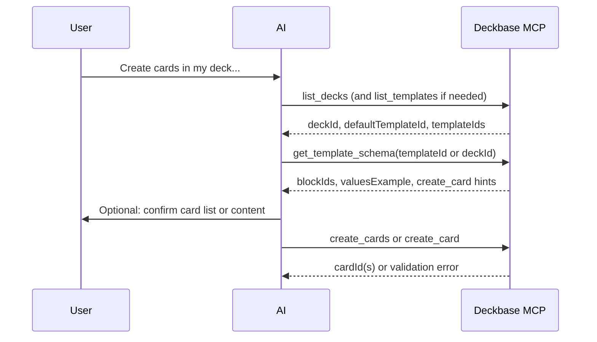

# AI-assisted card creation via Deckbase MCP

This document describes the **recommended end-to-end flow** when a client (or end user) asks an AI assistant to create flashcards: the assistant uses the hosted Deckbase MCP server to read the user’s decks and templates, fetch the exact field layout, then submit validated create requests.

It matches the behavior of the tools in `lib/mcp-handlers.js` and `lib/firestore-admin.js` (including request validation on `create_card` / `create_cards`).

---

## Is this the right mental model?

**Yes.** In short:

1. The user asks the AI to create cards (and usually names a deck or intent).
2. The AI uses MCP to **discover** where cards go (`list_decks`) and which **templates** exist (`list_templates`), or relies on a deck’s **default template** (`defaultTemplateId` from `list_decks`).
3. The AI calls **`get_template_schema`** so it knows the **exact** `blockId` keys, types, and hints for `block_text` / `front` for the chosen template.
4. The AI **maps** the user’s content into that structure (and may show the user a preview list of cards or fields before sending).
5. The AI calls **`create_card`** or **`create_cards`** with `deckId`, optional `templateId`, and `front` / `block_text` as needed.
6. Deckbase **validates** the payload (unknown `block_text` keys, required text blocks, at least one non-empty text field when the template has text blocks), then **writes** cards to the user’s account (dashboard + mobile sync).

Optional reference: **`list_block_schemas`** gives **generic** shapes per block *type*; **`get_template_schema`** gives the **instance** for one template (real `blockId`s). Prefer **`get_template_schema`** after the template is chosen.

---

## Sequence (high level)

---

## Step-by-step for implementers

### 1. Auth and endpoint

Use the **hosted** MCP URL with **`Authorization: Bearer <API_KEY>`** (Pro/VIP). Local stdio MCP does not run deck/card tools against Firestore.

### 2. Resolve deck and template

- Call **`list_decks`** → pick `deckId`. Note **`defaultTemplateId`** when set.
- If the user must pick a template explicitly, or the deck has no default, call **`list_templates`** → pick **`templateId`**.
- For **`create_card` / `create_cards`**: omit **`templateId`** when the deck’s default is correct; otherwise pass **`templateId`**.

### 3. Fetch exact layout for that template

- Call **`get_template_schema`** with **`templateId`** (from `list_templates`), **or** with **`deckId` only** to use the deck’s default template (same resolution as omitting `templateId` on create).
- Use the response to build **`block_text`** (`blockId` → string) and optional **`front`** (fills the template main block when still empty). Invalid keys are rejected at create time.

### 4. Prepare the user-visible “list” (assistant behavior)

The AI should **enumerate** the cards (or Q/A pairs) the user asked for, then map each row to **`front`** / **`block_text`** using **`get_template_schema`**. This is product/UX for the assistant, not a separate MCP tool.

### 5. Create cards

- One card: **`create_card`** with `deckId`, optional `templateId`, `front`, `block_text`.
- Many cards: **`create_cards`** with `deckId`, optional `templateId`, and **`cards`**: `[{ front?, block_text? }, ...]` (max **50** per request; repeat if needed).

### 6. Validation and errors

The server rejects requests when:

- **`block_text`** is not a plain object, or contains **unknown `blockId`s**.
- A **required** **text** block is empty after applying **`front`** / **`block_text`**.
- The template has **text** blocks but **none** of them have non-empty content after merge.

Templates with **only** non-text blocks (e.g. layout/media/quiz without text category blocks) are not forced to include text via MCP; adjust expectations if your templates are quiz-only.

On **`create_cards`**, if one item fails validation after earlier items succeeded, earlier cards may already exist—see the partial-result payload in the MCP docs.

---

## Related docs

- **[MCP.md](./MCP.md)** — Tool list, parameters, and example sequence.
- **Setup:** [Connecting to Deckbase MCP](https://www.deckbase.co/mcp)

---

## Server references

- `lib/mcp-handlers.js` — MCP tool entrypoints  
- `lib/firestore-admin.js` — `validateMcpCreateCardPayload`, `createCardFromTemplateAdmin`, `buildMcpTemplateCardSchema`  
- `app/api/mcp/route.js` — Hosted HTTP MCP route  
